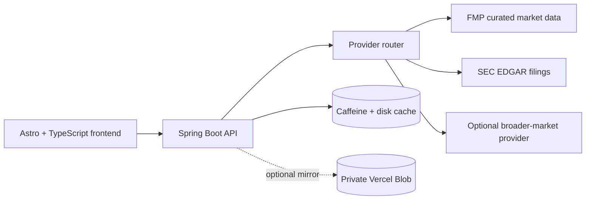

# Market Atlas

Market Atlas is an end-of-day U.S. stock research dashboard built to make company research calmer and easier to inspect. It combines price history, company fundamentals, SEC-backed financial statements, reported earnings, and side-by-side comparisons behind a small normalized API.

**[Open the live demo](https://batyrbek.com/finance)**

## What it does

- Searches a curated catalog and optionally resolves additional active U.S. common stocks.
- Displays quotes, company profiles, valuation metrics, and available price history.
- Presents annual financial statements and discrete reported quarters from SEC filings.
- Compares two companies on a normalized price chart and key financial metrics.
- Coalesces concurrent provider requests and caches datasets independently.
- Persists successful responses for graceful stale-data fallback during provider outages.
- Optionally mirrors normalized overview and history snapshots to a private Vercel Blob store.

## Architecture



The frontend receives normalized application DTOs rather than provider-specific payloads. API keys stay in the backend. Market data is end-of-day and each response carries freshness metadata.

## Repository layout

```text
market-atlas/
├── frontend/          Astro pages and browser-side TypeScript
├── backend/           Java 21 / Spring Boot API and tests
├── api/               Optional Vercel Blob snapshot function
├── .github/workflows  Frontend and backend CI
├── compose.yml        Local backend and persistent cache
└── .env.example       Safe configuration template
```

## Technology

- Astro 5 and TypeScript
- Java 21 and Spring Boot 3
- Caffeine plus atomic disk persistence
- FMP and SEC EDGAR provider adapters
- Docker and Docker Compose
- Vercel Blob for optional outage snapshots

## Run locally

Requirements: Node.js 22, npm, and Docker. Copy the safe environment template and provide your own provider credentials:

```bash
cp .env.example .env
docker compose up -d --build
```

Run the frontend against the local API:

```bash
cp frontend/.env.example frontend/.env
npm --prefix frontend ci
npm --prefix frontend run dev
```

Open `http://localhost:4321/finance`.

The backend can also run directly when Java 21 and Maven 3.9+ are installed:

```bash
mvn -f backend/pom.xml verify
FMP_API_KEY=your-key mvn -f backend/pom.xml spring-boot:run
```

Useful endpoints:

```text
GET /actuator/health
GET /api/finance/supported-stocks
GET /api/stocks/search?q=nvidia
GET /api/stocks/NVDA
GET /api/stocks/NVDA/history?range=5y
GET /api/stocks/NVDA/financials
GET /api/stocks/NVDA/earnings
```

## Configuration

The committed `.env.example` contains placeholders only. Never commit `.env`, provider keys, cache data, or Vercel credentials.

At minimum, configure `FMP_API_KEY`. Set `SEC_USER_AGENT` to a real application name and contact email before using SEC endpoints. Broader-market discovery and Vercel snapshots are optional.

## Data and product limits

Market Atlas is an educational portfolio project, not an investment service. Data may be delayed, incomplete, or stale. The interface identifies data sources and dates where available. Do not use it as the sole basis for financial decisions.

Provider access and redistribution remain subject to each provider's terms. This repository intentionally contains no credentials, cached market data, personal website code, or private deployment history.

## Author

Built by [Batyrbek](https://batyrbek.com). The live product is part of the Batyrbek.com portfolio.
